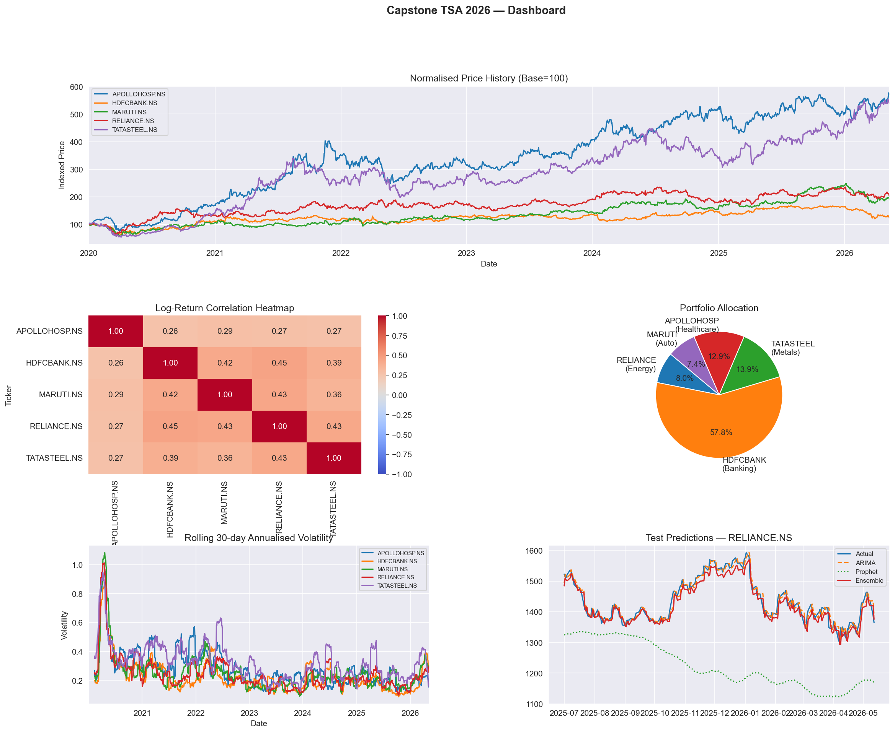
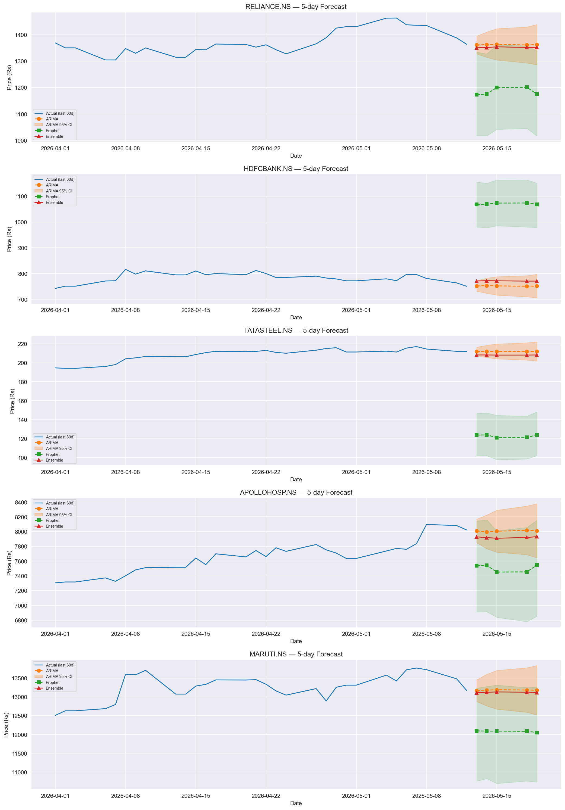
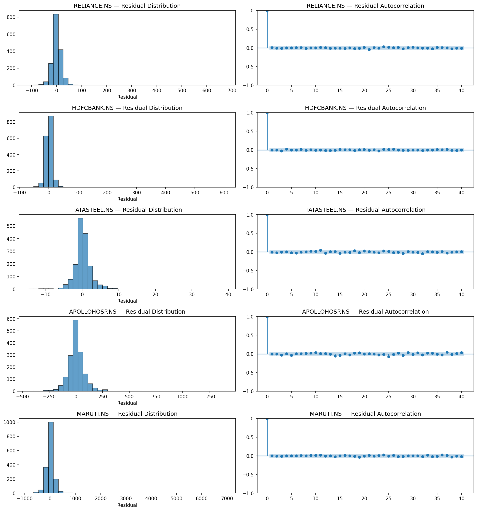

# Forecast-Driven Portfolio Allocation

Quantitative equity forecasting, volatility modelling, and portfolio optimization using ARIMA, Prophet, ensemble modelling, and walk-forward validation on NSE equities.

---

# Overview

This project implements a complete quantitative time-series forecasting workflow for Indian equity markets using:

- ARIMA forecasting
- Facebook Prophet
- Ensemble modelling
- Volatility analysis
- Walk-forward validation
- Portfolio optimization
- Residual diagnostics

The objective is to evaluate whether classical statistical forecasting methods can generate meaningful short-horizon signals for portfolio allocation.

---

# Stocks Used

- RELIANCE.NS
- HDFCBANK.NS
- TATASTEEL.NS
- APOLLOHOSP.NS
- MARUTI.NS

---

# Methodology

1. Data acquisition using Yahoo Finance
2. Data preprocessing and stationarity testing
3. ARIMA order selection via AIC grid search
4. Walk-forward forecasting validation
5. Prophet forecasting
6. Inverse-MAPE ensemble construction
7. Volatility regime analysis
8. Forecast-return portfolio allocation
9. Residual diagnostics and evaluation

---

# Key Features

- Strict walk-forward validation
- Avoidance of look-ahead bias
- ADF stationarity testing
- Ljung-Box residual diagnostics
- Jarque-Bera normality testing
- Rolling volatility analysis
- Portfolio allocation using forecast-return and inverse-volatility weighting

---

# Results

## Dashboard



## Forecast Confidence Intervals



## Residual Diagnostics



---

# Tech Stack

- Python
- Pandas
- NumPy
- Statsmodels
- Prophet
- Scikit-learn
- Matplotlib
- Seaborn

---

# Repository Structure

```text
forecast-driven-portfolio-allocation/
│
├── outputs/
├── notebooks/
├── reports/
├── src/
├── README.md
├── requirements.txt
└── .gitignore
